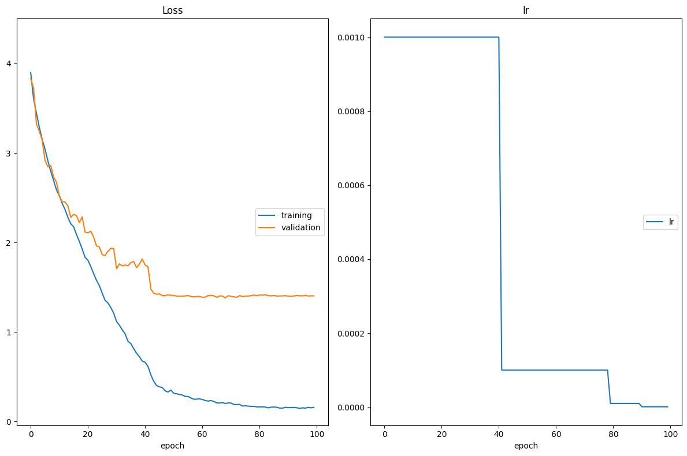
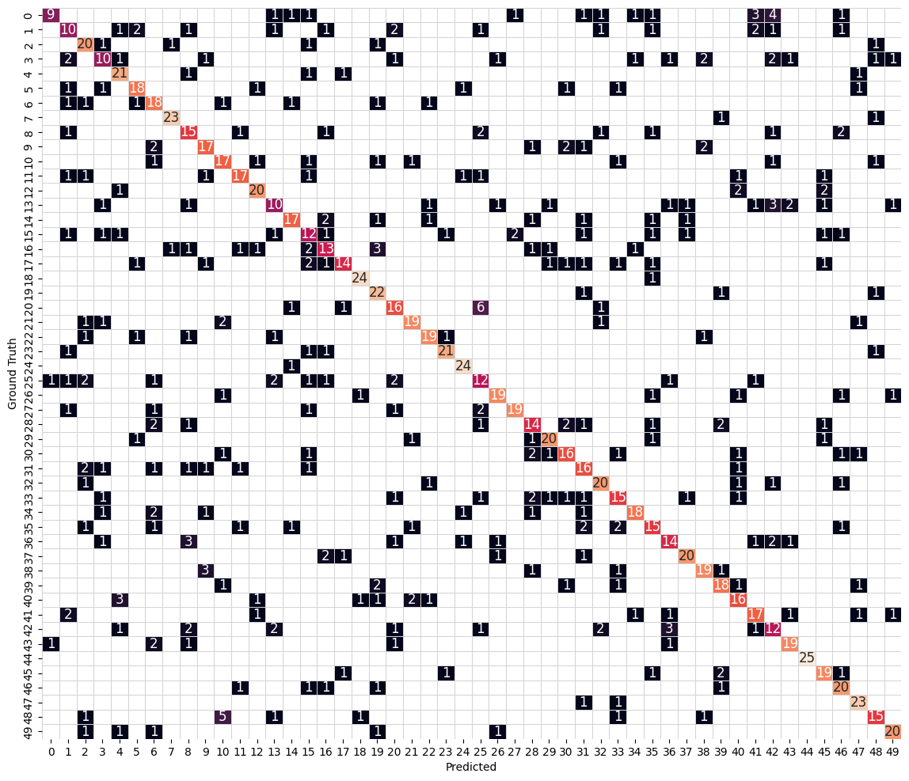

# Convolutional Neural Networks

## Project: Write an Algorithm for Landmark Classification


### Introduction

The project folder has the following structure:

* In the main directory you have this notebook, `cnn_from_scratch.ipynb`, that contains the instruction and some questions you will have to answer. Follow this notebook and complete the required sections in order.

* In the `src/` directory you have several source files. As instructed in this notebook, you will open and complete those files, then come back to this notebook to execute some tests that will verify what you have done. While these tests don't guarantee that your work is bug-free, they will help you finding the most obvious problems so you will be able to proceed to the next step with confidence.

* Sometimes you will need to restart the notebook. If you do so, remember to execute also the cells containing the code you have already completed starting from the top, before you move on.

>  Once you have completed all the code implementations, you need to finalize your work by exporting the Jupyter Notebook as an HTML document. Before exporting the notebook to HTML, all the code cells need to have been run so that reviewers can see the final implementation and output. You can then export the notebook by using the menu above and navigating to **File -> Download as -> HTML (.html)**. If you are using Jupyter Lab, you can use **File -> Export Notebook as -> Export Notebook to HTML**. Include the finished document along with this notebook as your submission.

In addition to implementing code, there will be questions that you must answer which relate to the project and your implementation. Each section where you will answer a question is preceded by a **'Question'** header. Carefully read each question and provide thorough answers in the following text boxes that begin with **'Answer:'**. Your project submission will be evaluated based on your answers to each of the questions and the implementation you provide.

>  Code and Markdown cells can be executed using the **Shift + Enter** keyboard shortcut.  Markdown cells can be edited by double-clicking the cell to enter edit mode.

The rubric contains _optional_ "Stand Out Suggestions" for enhancing the project beyond the minimum requirements. If you decide to pursue the "Stand Out Suggestions", you should include the code in this Jupyter notebook.

### Designing and training a CNN from scratch

In this notebook, you will create a CNN that classifies landmarks.  You must create your CNN _from scratch_ (so, you can't use transfer learning _yet_!), and you must attain a test accuracy of at least 50%.

Although 50% may seem low at first glance, it seems more reasonable after realizing how difficult of a problem this is. Many times, an image that is taken at a landmark captures a fairly mundane image of an animal or plant, like in the following picture.


Just by looking at that image alone, would you have been able to guess that it was taken at the Haleakalā National Park in Hawaii?

An accuracy of 50% is significantly better than random guessing, which would provide an accuracy of just 2% (100% / 50 classes). In Step 2 of this notebook, you will have the opportunity to greatly improve accuracy by using transfer learning to create a CNN.

Experiment with different architectures, hyperparameters, training strategies, and trust your intuition.  And, of course, have fun!

---
## " style="width:50px"/> Step 0: Setting up

The following cells make sure that your environment is setup correctly, download the data if you don't have it already, and also check that your GPU is available and ready to go. You have to execute them every time you restart your notebook.


```python
# Install requirements
!pip install -r requirements.txt | grep -v "already satisfied"
```

    Collecting opencv-python (from -r requirements.txt (line 1))
      Downloading opencv_python-4.10.0.84-cp37-abi3-manylinux_2_17_x86_64.manylinux2014_x86_64.whl.metadata (20 kB)
    Collecting matplotlib (from -r requirements.txt (line 2))
      Downloading matplotlib-3.9.3-cp310-cp310-manylinux_2_17_x86_64.manylinux2014_x86_64.whl.metadata (11 kB)
    Collecting numpy (from -r requirements.txt (line 3))
      Downloading numpy-2.1.3-cp310-cp310-manylinux_2_17_x86_64.manylinux2014_x86_64.whl.metadata (62 kB)
    Collecting pillow (from -r requirements.txt (line 4))
      Downloading pillow-11.0.0-cp310-cp310-manylinux_2_28_x86_64.whl.metadata (9.1 kB)
    Collecting bokeh (from -r requirements.txt (line 5))
      Downloading bokeh-3.6.1-py3-none-any.whl.metadata (12 kB)
    Collecting torch (from -r requirements.txt (line 6))
      Downloading torch-2.5.1-cp310-cp310-manylinux1_x86_64.whl.metadata (28 kB)
    Collecting torchvision (from -r requirements.txt (line 7))
      Downloading torchvision-0.20.1-cp310-cp310-manylinux1_x86_64.whl.metadata (6.1 kB)
    Collecting tqdm (from -r requirements.txt (line 8))
      Downloading tqdm-4.67.1-py3-none-any.whl.metadata (57 kB)
    Collecting ipywidgets (from -r requirements.txt (line 9))
      Downloading ipywidgets-8.1.5-py3-none-any.whl.metadata (2.3 kB)
    Collecting livelossplot (from -r requirements.txt (line 10))
      Downloading livelossplot-0.5.5-py3-none-any.whl.metadata (8.7 kB)
    Collecting pytest (from -r requirements.txt (line 11))
      Downloading pytest-8.3.4-py3-none-any.whl.metadata (7.5 kB)
    Collecting pandas (from -r requirements.txt (line 12))
      Downloading pandas-2.2.3-cp310-cp310-manylinux_2_17_x86_64.manylinux2014_x86_64.whl.metadata (89 kB)
    Collecting seaborn (from -r requirements.txt (line 13))
      Downloading seaborn-0.13.2-py3-none-any.whl.metadata (5.4 kB)
    Collecting contourpy>=1.0.1 (from matplotlib->-r requirements.txt (line 2))
      Downloading contourpy-1.3.1-cp310-cp310-manylinux_2_17_x86_64.manylinux2014_x86_64.whl.metadata (5.4 kB)
    Collecting cycler>=0.10 (from matplotlib->-r requirements.txt (line 2))
      Downloading cycler-0.12.1-py3-none-any.whl.metadata (3.8 kB)
    Collecting fonttools>=4.22.0 (from matplotlib->-r requirements.txt (line 2))
      Downloading fonttools-4.55.0-cp310-cp310-manylinux_2_17_x86_64.manylinux2014_x86_64.whl.metadata (164 kB)
    Collecting kiwisolver>=1.3.1 (from matplotlib->-r requirements.txt (line 2))
      Downloading kiwisolver-1.4.7-cp310-cp310-manylinux_2_12_x86_64.manylinux2010_x86_64.whl.metadata (6.3 kB)
    Collecting pyparsing>=2.3.1 (from matplotlib->-r requirements.txt (line 2))
      Downloading pyparsing-3.2.0-py3-none-any.whl.metadata (5.0 kB)
    Collecting Jinja2>=2.9 (from bokeh->-r requirements.txt (line 5))
      Downloading jinja2-3.1.4-py3-none-any.whl.metadata (2.6 kB)
    Collecting PyYAML>=3.10 (from bokeh->-r requirements.txt (line 5))
      Downloading PyYAML-6.0.2-cp310-cp310-manylinux_2_17_x86_64.manylinux2014_x86_64.whl.metadata (2.1 kB)
    Collecting xyzservices>=2021.09.1 (from bokeh->-r requirements.txt (line 5))
      Downloading xyzservices-2024.9.0-py3-none-any.whl.metadata (4.1 kB)
    Collecting filelock (from torch->-r requirements.txt (line 6))
      Downloading filelock-3.16.1-py3-none-any.whl.metadata (2.9 kB)
    Collecting networkx (from torch->-r requirements.txt (line 6))
      Downloading networkx-3.4.2-py3-none-any.whl.metadata (6.3 kB)
    Collecting fsspec (from torch->-r requirements.txt (line 6))
      Downloading fsspec-2024.10.0-py3-none-any.whl.metadata (11 kB)
    Collecting nvidia-cuda-nvrtc-cu12==12.4.127 (from torch->-r requirements.txt (line 6))
      Downloading nvidia_cuda_nvrtc_cu12-12.4.127-py3-none-manylinux2014_x86_64.whl.metadata (1.5 kB)
    Collecting nvidia-cuda-runtime-cu12==12.4.127 (from torch->-r requirements.txt (line 6))
      Downloading nvidia_cuda_runtime_cu12-12.4.127-py3-none-manylinux2014_x86_64.whl.metadata (1.5 kB)
    Collecting nvidia-cuda-cupti-cu12==12.4.127 (from torch->-r requirements.txt (line 6))
      Downloading nvidia_cuda_cupti_cu12-12.4.127-py3-none-manylinux2014_x86_64.whl.metadata (1.6 kB)
    Collecting nvidia-cudnn-cu12==9.1.0.70 (from torch->-r requirements.txt (line 6))
      Downloading nvidia_cudnn_cu12-9.1.0.70-py3-none-manylinux2014_x86_64.whl.metadata (1.6 kB)
    Collecting nvidia-cublas-cu12==12.4.5.8 (from torch->-r requirements.txt (line 6))
      Downloading nvidia_cublas_cu12-12.4.5.8-py3-none-manylinux2014_x86_64.whl.metadata (1.5 kB)
    Collecting nvidia-cufft-cu12==11.2.1.3 (from torch->-r requirements.txt (line 6))
      Downloading nvidia_cufft_cu12-11.2.1.3-py3-none-manylinux2014_x86_64.whl.metadata (1.5 kB)
    Collecting nvidia-curand-cu12==10.3.5.147 (from torch->-r requirements.txt (line 6))
      Downloading nvidia_curand_cu12-10.3.5.147-py3-none-manylinux2014_x86_64.whl.metadata (1.5 kB)
    Collecting nvidia-cusolver-cu12==11.6.1.9 (from torch->-r requirements.txt (line 6))
      Downloading nvidia_cusolver_cu12-11.6.1.9-py3-none-manylinux2014_x86_64.whl.metadata (1.6 kB)
    Collecting nvidia-cusparse-cu12==12.3.1.170 (from torch->-r requirements.txt (line 6))
      Downloading nvidia_cusparse_cu12-12.3.1.170-py3-none-manylinux2014_x86_64.whl.metadata (1.6 kB)
    Collecting nvidia-nccl-cu12==2.21.5 (from torch->-r requirements.txt (line 6))
      Downloading nvidia_nccl_cu12-2.21.5-py3-none-manylinux2014_x86_64.whl.metadata (1.8 kB)
    Collecting nvidia-nvtx-cu12==12.4.127 (from torch->-r requirements.txt (line 6))
      Downloading nvidia_nvtx_cu12-12.4.127-py3-none-manylinux2014_x86_64.whl.metadata (1.7 kB)
    Collecting nvidia-nvjitlink-cu12==12.4.127 (from torch->-r requirements.txt (line 6))
      Downloading nvidia_nvjitlink_cu12-12.4.127-py3-none-manylinux2014_x86_64.whl.metadata (1.5 kB)
    Collecting triton==3.1.0 (from torch->-r requirements.txt (line 6))
      Downloading triton-3.1.0-cp310-cp310-manylinux_2_17_x86_64.manylinux2014_x86_64.whl.metadata (1.3 kB)
    Collecting sympy==1.13.1 (from torch->-r requirements.txt (line 6))
      Downloading sympy-1.13.1-py3-none-any.whl.metadata (12 kB)
    Collecting mpmath<1.4,>=1.1.0 (from sympy==1.13.1->torch->-r requirements.txt (line 6))
      Downloading mpmath-1.3.0-py3-none-any.whl.metadata (8.6 kB)
    Collecting widgetsnbextension~=4.0.12 (from ipywidgets->-r requirements.txt (line 9))
      Downloading widgetsnbextension-4.0.13-py3-none-any.whl.metadata (1.6 kB)
    Collecting jupyterlab-widgets~=3.0.12 (from ipywidgets->-r requirements.txt (line 9))
      Downloading jupyterlab_widgets-3.0.13-py3-none-any.whl.metadata (4.1 kB)
    Collecting iniconfig (from pytest->-r requirements.txt (line 11))
      Downloading iniconfig-2.0.0-py3-none-any.whl.metadata (2.6 kB)
    Collecting pluggy<2,>=1.5 (from pytest->-r requirements.txt (line 11))
      Downloading pluggy-1.5.0-py3-none-any.whl.metadata (4.8 kB)
    Collecting tomli>=1 (from pytest->-r requirements.txt (line 11))
      Downloading tomli-2.2.1-py3-none-any.whl.metadata (10 kB)
    Collecting pytz>=2020.1 (from pandas->-r requirements.txt (line 12))
      Downloading pytz-2024.2-py2.py3-none-any.whl.metadata (22 kB)
    Collecting tzdata>=2022.7 (from pandas->-r requirements.txt (line 12))
      Downloading tzdata-2024.2-py2.py3-none-any.whl.metadata (1.4 kB)
    Collecting MarkupSafe>=2.0 (from Jinja2>=2.9->bokeh->-r requirements.txt (line 5))
      Downloading MarkupSafe-3.0.2-cp310-cp310-manylinux_2_17_x86_64.manylinux2014_x86_64.whl.metadata (4.0 kB)
    Downloading opencv_python-4.10.0.84-cp37-abi3-manylinux_2_17_x86_64.manylinux2014_x86_64.whl (62.5 MB)
       ━━━━━━━━━━━━━━━━━━━━━━━━━━━━━━━━━━━━━━━━ 62.5/62.5 MB 19.3 MB/s eta 0:00:0000:0100:01
    [?25hDownloading matplotlib-3.9.3-cp310-cp310-manylinux_2_17_x86_64.manylinux2014_x86_64.whl (8.3 MB)
       ━━━━━━━━━━━━━━━━━━━━━━━━━━━━━━━━━━━━━━━━ 8.3/8.3 MB 11.2 MB/s eta 0:00:00a 0:00:01
    [?25hDownloading numpy-2.1.3-cp310-cp310-manylinux_2_17_x86_64.manylinux2014_x86_64.whl (16.3 MB)
       ━━━━━━━━━━━━━━━━━━━━━━━━━━━━━━━━━━━━━━━━ 16.3/16.3 MB 11.8 MB/s eta 0:00:00a 0:00:01
    [?25hDownloading pillow-11.0.0-cp310-cp310-manylinux_2_28_x86_64.whl (4.4 MB)
       ━━━━━━━━━━━━━━━━━━━━━━━━━━━━━━━━━━━━━━━━ 4.4/4.4 MB 8.8 MB/s eta 0:00:00a 0:00:01
    [?25hDownloading bokeh-3.6.1-py3-none-any.whl (6.9 MB)
       ━━━━━━━━━━━━━━━━━━━━━━━━━━━━━━━━━━━━━━━━ 6.9/6.9 MB 9.4 MB/s eta 0:00:00a 0:00:01
    [?25hDownloading torch-2.5.1-cp310-cp310-manylinux1_x86_64.whl (906.4 MB)
       ━━━━━━━━━━━━━━━━━━━━━━━━━━━━━━━━━━━━━━━━ 906.4/906.4 MB 8.7 MB/s eta 0:00:0000:0100:03m
    [?25hDownloading nvidia_cublas_cu12-12.4.5.8-py3-none-manylinux2014_x86_64.whl (363.4 MB)
       ━━━━━━━━━━━━━━━━━━━━━━━━━━━━━━━━━━━━━━━━ 363.4/363.4 MB 3.3 MB/s eta 0:00:0000:0100:03
    [?25hDownloading nvidia_cuda_cupti_cu12-12.4.127-py3-none-manylinux2014_x86_64.whl (13.8 MB)
       ━━━━━━━━━━━━━━━━━━━━━━━━━━━━━━━━━━━━━━━━ 13.8/13.8 MB 8.9 MB/s eta 0:00:00a 0:00:01
    [?25hDownloading nvidia_cuda_nvrtc_cu12-12.4.127-py3-none-manylinux2014_x86_64.whl (24.6 MB)
       ━━━━━━━━━━━━━━━━━━━━━━━━━━━━━━━━━━━━━━━━ 24.6/24.6 MB 9.1 MB/s eta 0:00:0000:0100:01
    [?25hDownloading nvidia_cuda_runtime_cu12-12.4.127-py3-none-manylinux2014_x86_64.whl (883 kB)
       ━━━━━━━━━━━━━━━━━━━━━━━━━━━━━━━━━━━━━━━━ 883.7/883.7 kB 8.5 MB/s eta 0:00:00
    [?25hDownloading nvidia_cudnn_cu12-9.1.0.70-py3-none-manylinux2014_x86_64.whl (664.8 MB)
       ━━━━━━━━━━━━━━━━━━━━━━━━━━━━━━━━━━━━━━━━ 664.8/664.8 MB 13.2 MB/s eta 0:00:0000:0100:02
    [?25hDownloading nvidia_cufft_cu12-11.2.1.3-py3-none-manylinux2014_x86_64.whl (211.5 MB)
       ━━━━━━━━━━━━━━━━━━━━━━━━━━━━━━━━━━━━━━━━ 211.5/211.5 MB 12.4 MB/s eta 0:00:0000:0100:01
    [?25hDownloading nvidia_curand_cu12-10.3.5.147-py3-none-manylinux2014_x86_64.whl (56.3 MB)
       ━━━━━━━━━━━━━━━━━━━━━━━━━━━━━━━━━━━━━━━━ 56.3/56.3 MB 7.7 MB/s eta 0:00:0000:0100:01
    [?25hDownloading nvidia_cusolver_cu12-11.6.1.9-py3-none-manylinux2014_x86_64.whl (127.9 MB)
       ━━━━━━━━━━━━━━━━━━━━━━━━━━━━━━━━━━━━━━━━ 127.9/127.9 MB 1.9 MB/s eta 0:00:0000:0100:020:00:14
    [?25hDownloading nvidia_cusparse_cu12-12.3.1.170-py3-none-manylinux2014_x86_64.whl (207.5 MB)
       ━━━━━━━━━━━━━━━━━━━━━━━━━━━━━━━━━━━━━━━━ 207.5/207.5 MB 3.5 MB/s eta 0:00:0000:0100:02
    [?25hDownloading nvidia_nccl_cu12-2.21.5-py3-none-manylinux2014_x86_64.whl (188.7 MB)
       ━━━━━━━━━━━━━━━━━━━━━━━━━━━━━━━━━━━━━━━━ 188.7/188.7 MB 4.0 MB/s eta 0:00:0000:0100:02
    [?25hDownloading nvidia_nvjitlink_cu12-12.4.127-py3-none-manylinux2014_x86_64.whl (21.1 MB)
       ━━━━━━━━━━━━━━━━━━━━━━━━━━━━━━━━━━━━━━━━ 21.1/21.1 MB 9.2 MB/s eta 0:00:0000:0100:01
    [?25hDownloading nvidia_nvtx_cu12-12.4.127-py3-none-manylinux2014_x86_64.whl (99 kB)
    Downloading sympy-1.13.1-py3-none-any.whl (6.2 MB)
       ━━━━━━━━━━━━━━━━━━━━━━━━━━━━━━━━━━━━━━━━ 6.2/6.2 MB 9.9 MB/s eta 0:00:00ta 0:00:01
    [?25hDownloading triton-3.1.0-cp310-cp310-manylinux_2_17_x86_64.manylinux2014_x86_64.whl (209.5 MB)
       ━━━━━━━━━━━━━━━━━━━━━━━━━━━━━━━━━━━━━━━━ 209.5/209.5 MB 12.3 MB/s eta 0:00:0000:0100:01
    [?25hDownloading torchvision-0.20.1-cp310-cp310-manylinux1_x86_64.whl (7.2 MB)
       ━━━━━━━━━━━━━━━━━━━━━━━━━━━━━━━━━━━━━━━━ 7.2/7.2 MB 9.2 MB/s eta 0:00:00a 0:00:01
    [?25hDownloading tqdm-4.67.1-py3-none-any.whl (78 kB)
    Downloading ipywidgets-8.1.5-py3-none-any.whl (139 kB)
    Downloading livelossplot-0.5.5-py3-none-any.whl (22 kB)
    Downloading pytest-8.3.4-py3-none-any.whl (343 kB)
    Downloading pandas-2.2.3-cp310-cp310-manylinux_2_17_x86_64.manylinux2014_x86_64.whl (13.1 MB)
       ━━━━━━━━━━━━━━━━━━━━━━━━━━━━━━━━━━━━━━━━ 13.1/13.1 MB 6.5 MB/s eta 0:00:00a 0:00:01
    [?25hDownloading seaborn-0.13.2-py3-none-any.whl (294 kB)
    Downloading contourpy-1.3.1-cp310-cp310-manylinux_2_17_x86_64.manylinux2014_x86_64.whl (324 kB)
    Downloading cycler-0.12.1-py3-none-any.whl (8.3 kB)
    Downloading fonttools-4.55.0-cp310-cp310-manylinux_2_17_x86_64.manylinux2014_x86_64.whl (4.6 MB)
       ━━━━━━━━━━━━━━━━━━━━━━━━━━━━━━━━━━━━━━━━ 4.6/4.6 MB 5.5 MB/s eta 0:00:00a 0:00:01
    [?25hDownloading jinja2-3.1.4-py3-none-any.whl (133 kB)
    Downloading jupyterlab_widgets-3.0.13-py3-none-any.whl (214 kB)
    Downloading kiwisolver-1.4.7-cp310-cp310-manylinux_2_12_x86_64.manylinux2010_x86_64.whl (1.6 MB)
       ━━━━━━━━━━━━━━━━━━━━━━━━━━━━━━━━━━━━━━━━ 1.6/1.6 MB 5.5 MB/s eta 0:00:00a 0:00:01
    [?25hDownloading pluggy-1.5.0-py3-none-any.whl (20 kB)
    Downloading pyparsing-3.2.0-py3-none-any.whl (106 kB)
    Downloading pytz-2024.2-py2.py3-none-any.whl (508 kB)
    Downloading PyYAML-6.0.2-cp310-cp310-manylinux_2_17_x86_64.manylinux2014_x86_64.whl (751 kB)
       ━━━━━━━━━━━━━━━━━━━━━━━━━━━━━━━━━━━━━━━━ 751.2/751.2 kB 8.4 MB/s eta 0:00:00
    [?25hDownloading tomli-2.2.1-py3-none-any.whl (14 kB)
    Downloading tzdata-2024.2-py2.py3-none-any.whl (346 kB)
    Downloading widgetsnbextension-4.0.13-py3-none-any.whl (2.3 MB)
       ━━━━━━━━━━━━━━━━━━━━━━━━━━━━━━━━━━━━━━━━ 2.3/2.3 MB 4.2 MB/s eta 0:00:00a 0:00:01
    [?25hDownloading xyzservices-2024.9.0-py3-none-any.whl (85 kB)
    Downloading filelock-3.16.1-py3-none-any.whl (16 kB)
    Downloading fsspec-2024.10.0-py3-none-any.whl (179 kB)
    Downloading iniconfig-2.0.0-py3-none-any.whl (5.9 kB)
    Downloading networkx-3.4.2-py3-none-any.whl (1.7 MB)
       ━━━━━━━━━━━━━━━━━━━━━━━━━━━━━━━━━━━━━━━━ 1.7/1.7 MB 4.4 MB/s eta 0:00:00a 0:00:01
    [?25hDownloading MarkupSafe-3.0.2-cp310-cp310-manylinux_2_17_x86_64.manylinux2014_x86_64.whl (20 kB)
    Downloading mpmath-1.3.0-py3-none-any.whl (536 kB)
       ━━━━━━━━━━━━━━━━━━━━━━━━━━━━━━━━━━━━━━━━ 536.2/536.2 kB 4.2 MB/s eta 0:00:00
    [?25hInstalling collected packages: pytz, mpmath, xyzservices, widgetsnbextension, tzdata, tqdm, tomli, sympy, PyYAML, pyparsing, pluggy, pillow, nvidia-nvtx-cu12, nvidia-nvjitlink-cu12, nvidia-nccl-cu12, nvidia-curand-cu12, nvidia-cufft-cu12, nvidia-cuda-runtime-cu12, nvidia-cuda-nvrtc-cu12, nvidia-cuda-cupti-cu12, nvidia-cublas-cu12, numpy, networkx, MarkupSafe, kiwisolver, jupyterlab-widgets, iniconfig, fsspec, fonttools, filelock, cycler, triton, pytest, pandas, opencv-python, nvidia-cusparse-cu12, nvidia-cudnn-cu12, Jinja2, contourpy, nvidia-cusolver-cu12, matplotlib, bokeh, torch, seaborn, livelossplot, ipywidgets, torchvision
    Successfully installed Jinja2-3.1.4 MarkupSafe-3.0.2 PyYAML-6.0.2 bokeh-3.6.1 contourpy-1.3.1 cycler-0.12.1 filelock-3.16.1 fonttools-4.55.0 fsspec-2024.10.0 iniconfig-2.0.0 ipywidgets-8.1.5 jupyterlab-widgets-3.0.13 kiwisolver-1.4.7 livelossplot-0.5.5 matplotlib-3.9.3 mpmath-1.3.0 networkx-3.4.2 numpy-2.1.3 nvidia-cublas-cu12-12.4.5.8 nvidia-cuda-cupti-cu12-12.4.127 nvidia-cuda-nvrtc-cu12-12.4.127 nvidia-cuda-runtime-cu12-12.4.127 nvidia-cudnn-cu12-9.1.0.70 nvidia-cufft-cu12-11.2.1.3 nvidia-curand-cu12-10.3.5.147 nvidia-cusolver-cu12-11.6.1.9 nvidia-cusparse-cu12-12.3.1.170 nvidia-nccl-cu12-2.21.5 nvidia-nvjitlink-cu12-12.4.127 nvidia-nvtx-cu12-12.4.127 opencv-python-4.10.0.84 pandas-2.2.3 pillow-11.0.0 pluggy-1.5.0 pyparsing-3.2.0 pytest-8.3.4 pytz-2024.2 seaborn-0.13.2 sympy-1.13.1 tomli-2.2.1 torch-2.5.1 torchvision-0.20.1 tqdm-4.67.1 triton-3.1.0 tzdata-2024.2 widgetsnbextension-4.0.13 xyzservices-2024.9.0


```python
from src.helpers import setup_env

# If running locally, this will download dataset (make sure you have at 
# least 2 Gb of space on your hard drive)
setup_env()
```

    GPU available
    Downloading and unzipping https://udacity-dlnfd.s3-us-west-1.amazonaws.com/datasets/landmark_images.zip. This will take a while...
    done
    Reusing cached mean and std


    /home/brick-dev-server-1/Projects/AnhTH/DeeplearningCourse_Project3/src/helpers.py:98: FutureWarning: You are using `torch.load` with `weights_only=False` (the current default value), which uses the default pickle module implicitly. It is possible to construct malicious pickle data which will execute arbitrary code during unpickling (See https://github.com/pytorch/pytorch/blob/main/SECURITY.md#untrusted-models for more details). In a future release, the default value for `weights_only` will be flipped to `True`. This limits the functions that could be executed during unpickling. Arbitrary objects will no longer be allowed to be loaded via this mode unless they are explicitly allowlisted by the user via `torch.serialization.add_safe_globals`. We recommend you start setting `weights_only=True` for any use case where you don't have full control of the loaded file. Please open an issue on GitHub for any issues related to this experimental feature.
      d = torch.load(cache_file)


---
## " style="width:50px"/> Step 1: Data

In this and the following steps we are going to complete some code, and then execute some tests to make sure the code works as intended. 

Open the file `src/data.py`. It contains a function called `get_data_loaders`. Read the function and complete all the parts marked by `YOUR CODE HERE`. Once you have finished, test that your implementation is correct by executing the following cell (see below for what to do if a test fails):


```python
!pytest -vv src/data.py -k data_loaders
```

    ============================= test session starts ==============================
    platform linux -- Python 3.10.15, pytest-8.3.4, pluggy-1.5.0 -- /home/brick-dev-server-1/miniconda3/envs/anhth/bin/python
    cachedir: .pytest_cache
    rootdir: /home/brick-dev-server-1/Projects/AnhTH/DeeplearningCourse_Project3
    collected 4 items / 1 deselected / 3 selected                                  
    
    src/data.py::test_data_loaders_keys PASSED                               [ 33%]
    src/data.py::test_data_loaders_output_type PASSED                        [ 66%]
    src/data.py::test_data_loaders_output_shape PASSED                       [100%]
    
    =============================== warnings summary ===============================
    src/data.py::test_data_loaders_keys
      /home/brick-dev-server-1/Projects/AnhTH/DeeplearningCourse_Project3/src/helpers.py:98: FutureWarning: You are using `torch.load` with `weights_only=False` (the current default value), which uses the default pickle module implicitly. It is possible to construct malicious pickle data which will execute arbitrary code during unpickling (See https://github.com/pytorch/pytorch/blob/main/SECURITY.md#untrusted-models for more details). In a future release, the default value for `weights_only` will be flipped to `True`. This limits the functions that could be executed during unpickling. Arbitrary objects will no longer be allowed to be loaded via this mode unless they are explicitly allowlisted by the user via `torch.serialization.add_safe_globals`. We recommend you start setting `weights_only=True` for any use case where you don't have full control of the loaded file. Please open an issue on GitHub for any issues related to this experimental feature.
        d = torch.load(cache_file)
    
    -- Docs: https://docs.pytest.org/en/stable/how-to/capture-warnings.html
    ================== 3 passed, 1 deselected, 1 warning in 3.11s ==================


You should see something like:
```
src/data.py::test_data_loaders_keys PASSED                               [ 33%]
src/data.py::test_data_loaders_output_type PASSED                        [ 66%]
src/data.py::test_data_loaders_output_shape PASSED                       [100%]

======================= 3 passed, 1 deselected in 1.81s ========================
```
If all the tests are `PASSED`, you can move to the next section.

>  **What to do if tests fail**
When a test fails, `pytest` will mark it as `FAILED` as opposed to `PASSED`, and will print a lot of useful output, including a message that should tell you what the problem is. For example, this is the output of a failed test:
> ```
>    def test_data_loaders_keys(data_loaders):
>    
>       assert set(data_loaders.keys()) == {"train", "valid", "test"}
E       AssertionError: assert {'tes', 'train', 'valid'} == {'test', 'train', 'valid'}
E         Extra items in the left set:
E         'tes'
E         Full diff:
E         - {'test', 'train', 'valid'}
E         + {'tes', 'train', 'valid'}
E         ?                          +++++++
>
> src/data.py:171: AssertionError
-------------- Captured stdout setup ----------------------------------------------
Reusing cached mean and std for landmark_images
Dataset mean: tensor([0.4638, 0.4725, 0.4687]), std: tensor([0.2699, 0.2706, 0.3018])
=========== short test summary info ===============================================
FAILED src/data.py::test_data_loaders_keys - AssertionError: The keys of the data_loaders dictionary should be train, valid and test
> ``` 
> In the `short test summary info` you can see a short description of the problem. In this case, the dictionary we are returning has the wrong keys. Going above a little, you can see that the test expects `{'test', 'train', 'valid'}` while we are returning `{'tes', 'train', 'valid'}` (there is a missing `t`). So we can go back to our function, fix that problem and test again.
> 
> In other cases, you might get an error like:
> ```
    def _conv_forward(self, input: Tensor, weight: Tensor, bias: Optional[Tensor]):
        if self.padding_mode != 'zeros':
            return F.conv2d(F.pad(input, self._reversed_padding_repeated_twice, mode=self.padding_mode),
                            weight, bias, self.stride,
                            _pair(0), self.dilation, self.groups)
        return F.conv2d(input, weight, bias, self.stride,
>                       self.padding, self.dilation, self.groups)
E       RuntimeError: Input type (torch.cuda.FloatTensor) and weight type (torch.FloatTensor) should be the same
>
> ../../../../miniconda3/envs/udacity_starter/lib/python3.7/site-packages/torch/nn/modules/conv.py:440: RuntimeError
> ```
> Looking at the stack trace you should be able to understand what it is going on. In this case, we forgot to add a `.cuda()` to some tensor. For example, the model is on the GPU, but the data aren't.

 **Question:** Describe your chosen procedure for preprocessing the data. 
- How does your code resize the images (by cropping, stretching, etc)?  What size did you pick for the input tensor, and why?
- Did you decide to augment the dataset?  If so, how (through translations, flips, rotations, etc)?  If not, why not?

" style="width:25px"/> **Answer**: 

1. First, I resize the original image to 256 and then crop it to 244. Why do I choose 244 instead of 256? It is because the pre-trained model uses an input size of 244, so I recommend using an image size of 244 for more efficient model training.

2. The augmentation step has a significant impact on the model's results. I choose RandomCrop, RandomHorizontalFlip, and ColorJitter for the training set to ensure the model learns from diverse cases. On the other hand, for the validation and test sets, we need stable results to calculate the loss function accurately, so I only use Resize and CenterCrop for both sets.


### Visualize a Batch of Training Data

Go back to `src/data.py` and complete the function `visualize_one_batch` in all places with the `YOUR CODE HERE` marker. After you're done, execute the following cell and make sure the test `src/data.py::test_visualize_one_batch` is `PASSED`:


```python
!pytest -vv src/data.py -k visualize_one_batch
```

    ============================= test session starts ==============================
    platform linux -- Python 3.10.15, pytest-8.3.4, pluggy-1.5.0 -- /home/brick-dev-server-1/miniconda3/envs/anhth/bin/python
    cachedir: .pytest_cache
    rootdir: /home/brick-dev-server-1/Projects/AnhTH/DeeplearningCourse_Project3
    collected 4 items / 3 deselected / 1 selected                                  
    
    src/data.py::test_visualize_one_batch PASSED                             [100%]
    
    =============================== warnings summary ===============================
    src/data.py::test_visualize_one_batch
      /home/brick-dev-server-1/Projects/AnhTH/DeeplearningCourse_Project3/src/helpers.py:98: FutureWarning: You are using `torch.load` with `weights_only=False` (the current default value), which uses the default pickle module implicitly. It is possible to construct malicious pickle data which will execute arbitrary code during unpickling (See https://github.com/pytorch/pytorch/blob/main/SECURITY.md#untrusted-models for more details). In a future release, the default value for `weights_only` will be flipped to `True`. This limits the functions that could be executed during unpickling. Arbitrary objects will no longer be allowed to be loaded via this mode unless they are explicitly allowlisted by the user via `torch.serialization.add_safe_globals`. We recommend you start setting `weights_only=True` for any use case where you don't have full control of the loaded file. Please open an issue on GitHub for any issues related to this experimental feature.
        d = torch.load(cache_file)
    
    src/data.py::test_visualize_one_batch
    src/data.py::test_visualize_one_batch
      /home/brick-dev-server-1/miniconda3/envs/anhth/lib/python3.10/site-packages/matplotlib/cbook.py:733: DeprecationWarning: __array__ implementation doesn't accept a copy keyword, so passing copy=False failed. __array__ must implement 'dtype' and 'copy' keyword arguments.
        x = np.array(x, subok=True, copy=copy)
    
    -- Docs: https://docs.pytest.org/en/stable/how-to/capture-warnings.html
    ================= 1 passed, 3 deselected, 3 warnings in 3.33s ==================


We can now use the code we just completed to get a batch of images from your train data loader and look at them.

Visualizing the output of your data loader is a great way to ensure that your data loading and preprocessing (including transforms such as rotations, translations, color transforms...) are working as expected.


```python
%matplotlib inline
from src.data import visualize_one_batch, get_data_loaders

# use get_data_loaders to get the data_loaders dictionary. Use a batch_size
# of 5, a validation size of 0.01 and num_workers=-1 (all CPUs)
data_loaders = get_data_loaders(batch_size=5, valid_size=0.01, num_workers=-1)

visualize_one_batch(data_loaders)
```

    Reusing cached mean and std
    Dataset mean: tensor([0.4638, 0.4725, 0.4687]), std: tensor([0.2697, 0.2706, 0.3017])
    Reusing cached mean and std


    

    


---
## " style="width:50px"/> Step 2: Define model

Open `src/model.py` and complete the `MyModel` class filling in all the `YOUR CODE HERE` sections. After you're done, execute the following test and make sure it passes:


```python
!pytest -vv src/model.py
```

    ============================= test session starts ==============================
    platform linux -- Python 3.10.15, pytest-8.3.4, pluggy-1.5.0 -- /home/brick-dev-server-1/miniconda3/envs/anhth/bin/python
    cachedir: .pytest_cache
    rootdir: /home/brick-dev-server-1/Projects/AnhTH/DeeplearningCourse_Project3
    collected 1 item                                                               
    
    src/model.py::test_model_construction PASSED                             [100%]
    
    =============================== warnings summary ===============================
    src/model.py::test_model_construction
      /home/brick-dev-server-1/Projects/AnhTH/DeeplearningCourse_Project3/src/helpers.py:98: FutureWarning: You are using `torch.load` with `weights_only=False` (the current default value), which uses the default pickle module implicitly. It is possible to construct malicious pickle data which will execute arbitrary code during unpickling (See https://github.com/pytorch/pytorch/blob/main/SECURITY.md#untrusted-models for more details). In a future release, the default value for `weights_only` will be flipped to `True`. This limits the functions that could be executed during unpickling. Arbitrary objects will no longer be allowed to be loaded via this mode unless they are explicitly allowlisted by the user via `torch.serialization.add_safe_globals`. We recommend you start setting `weights_only=True` for any use case where you don't have full control of the loaded file. Please open an issue on GitHub for any issues related to this experimental feature.
        d = torch.load(cache_file)
    
    -- Docs: https://docs.pytest.org/en/stable/how-to/capture-warnings.html
    ========================= 1 passed, 1 warning in 4.19s =========================


 **Question**: Outline the steps you took to get to your final CNN architecture and your reasoning at each step.  

" style="width:25px"/> __Answer:__ 

1. Besides the standard CNN architecture, I am using Global Average Pooling (GAP) before the Flatten layer. Moreover, I have added a Dropout layer to minimize overfitting. The number of output layers will be based on the parameter specifying the number of class labels in the dataset.

---
## " style="width:50px"/> Step 3: define loss and optimizer

Open `src/optimization.py` and complete the `get_loss` function, then execute the test and make sure it passes:


```python
!pytest -vv src/optimization.py -k get_loss
```

    ============================= test session starts ==============================
    platform linux -- Python 3.10.15, pytest-8.3.4, pluggy-1.5.0 -- /home/brick-dev-server-1/miniconda3/envs/anhth/bin/python
    cachedir: .pytest_cache
    rootdir: /home/brick-dev-server-1/Projects/AnhTH/DeeplearningCourse_Project3
    collected 7 items / 6 deselected / 1 selected                                  
    
    src/optimization.py::test_get_loss PASSED                                [100%]
    
    ======================= 1 passed, 6 deselected in 1.51s ========================


Then, in the same file, complete the `get_optimizer` function then execute its tests, and make sure they all pass:


```python
!pytest -vv src/optimization.py -k get_optimizer
```

    ============================= test session starts ==============================
    platform linux -- Python 3.10.15, pytest-8.3.4, pluggy-1.5.0 -- /home/brick-dev-server-1/miniconda3/envs/anhth/bin/python
    cachedir: .pytest_cache
    rootdir: /home/brick-dev-server-1/Projects/AnhTH/DeeplearningCourse_Project3
    collected 7 items / 1 deselected / 6 selected                                  
    
    src/optimization.py::test_get_optimizer_type PASSED                      [ 16%]
    src/optimization.py::test_get_optimizer_is_linked_with_model PASSED      [ 33%]
    src/optimization.py::test_get_optimizer_returns_adam PASSED              [ 50%]
    src/optimization.py::test_get_optimizer_sets_learning_rate PASSED        [ 66%]
    src/optimization.py::test_get_optimizer_sets_momentum PASSED             [ 83%]
    src/optimization.py::test_get_optimizer_sets_weight_decat PASSED         [100%]
    
    ======================= 6 passed, 1 deselected in 2.51s ========================


---
## " style="width:50px"/> Step 4: Train and Validate the Model

>  Testing ML code is notoriously difficult. The tests in this section merely exercise the functions you are completing, so it will help you catching glaring problems but it won't guarantee that your training code is bug-free. If you see that your loss is not decreasing, for example, that's a sign of a bug or of a flawed model design. Use your judgement.

Open `src/train.py` and complete the `train_one_epoch` function, then run the tests:


```python
!pytest -vv src/train.py -k train_one_epoch
```

    ============================= test session starts ==============================
    platform linux -- Python 3.10.15, pytest-8.3.4, pluggy-1.5.0 -- /home/brick-dev-server-1/miniconda3/envs/anhth/bin/python
    cachedir: .pytest_cache
    rootdir: /home/brick-dev-server-1/Projects/AnhTH/DeeplearningCourse_Project3
    collected 4 items / 3 deselected / 1 selected                                  
    
    src/train.py::test_train_one_epoch PASSED                                [100%]
    
    =============================== warnings summary ===============================
    src/train.py::test_train_one_epoch
      /home/brick-dev-server-1/Projects/AnhTH/DeeplearningCourse_Project3/src/helpers.py:98: FutureWarning: You are using `torch.load` with `weights_only=False` (the current default value), which uses the default pickle module implicitly. It is possible to construct malicious pickle data which will execute arbitrary code during unpickling (See https://github.com/pytorch/pytorch/blob/main/SECURITY.md#untrusted-models for more details). In a future release, the default value for `weights_only` will be flipped to `True`. This limits the functions that could be executed during unpickling. Arbitrary objects will no longer be allowed to be loaded via this mode unless they are explicitly allowlisted by the user via `torch.serialization.add_safe_globals`. We recommend you start setting `weights_only=True` for any use case where you don't have full control of the loaded file. Please open an issue on GitHub for any issues related to this experimental feature.
        d = torch.load(cache_file)
    
    -- Docs: https://docs.pytest.org/en/stable/how-to/capture-warnings.html
    ================== 1 passed, 3 deselected, 1 warning in 6.05s ==================


Now complete the `valid` function, then run the tests:


```python
!pytest -vv src/train.py -k valid_one_epoch
```

    ============================= test session starts ==============================
    platform linux -- Python 3.10.15, pytest-8.3.4, pluggy-1.5.0 -- /home/brick-dev-server-1/miniconda3/envs/anhth/bin/python
    cachedir: .pytest_cache
    rootdir: /home/brick-dev-server-1/Projects/AnhTH/DeeplearningCourse_Project3
    collected 4 items / 3 deselected / 1 selected                                  
    
    src/train.py::test_valid_one_epoch PASSED                                [100%]
    
    =============================== warnings summary ===============================
    src/train.py::test_valid_one_epoch
      /home/brick-dev-server-1/Projects/AnhTH/DeeplearningCourse_Project3/src/helpers.py:98: FutureWarning: You are using `torch.load` with `weights_only=False` (the current default value), which uses the default pickle module implicitly. It is possible to construct malicious pickle data which will execute arbitrary code during unpickling (See https://github.com/pytorch/pytorch/blob/main/SECURITY.md#untrusted-models for more details). In a future release, the default value for `weights_only` will be flipped to `True`. This limits the functions that could be executed during unpickling. Arbitrary objects will no longer be allowed to be loaded via this mode unless they are explicitly allowlisted by the user via `torch.serialization.add_safe_globals`. We recommend you start setting `weights_only=True` for any use case where you don't have full control of the loaded file. Please open an issue on GitHub for any issues related to this experimental feature.
        d = torch.load(cache_file)
    
    -- Docs: https://docs.pytest.org/en/stable/how-to/capture-warnings.html
    ================== 1 passed, 3 deselected, 1 warning in 5.38s ==================


Now complete the `optimize` function, then run the tests:


```python
!pytest -vv src/train.py -k optimize
```

    ============================= test session starts ==============================
    platform linux -- Python 3.10.15, pytest-8.3.4, pluggy-1.5.0 -- /home/brick-dev-server-1/miniconda3/envs/anhth/bin/python
    cachedir: .pytest_cache
    rootdir: /home/brick-dev-server-1/Projects/AnhTH/DeeplearningCourse_Project3
    collected 4 items / 3 deselected / 1 selected                                  
    
    src/train.py::test_optimize PASSED                                       [100%]
    
    =============================== warnings summary ===============================
    src/train.py::test_optimize
      /home/brick-dev-server-1/Projects/AnhTH/DeeplearningCourse_Project3/src/helpers.py:98: FutureWarning: You are using `torch.load` with `weights_only=False` (the current default value), which uses the default pickle module implicitly. It is possible to construct malicious pickle data which will execute arbitrary code during unpickling (See https://github.com/pytorch/pytorch/blob/main/SECURITY.md#untrusted-models for more details). In a future release, the default value for `weights_only` will be flipped to `True`. This limits the functions that could be executed during unpickling. Arbitrary objects will no longer be allowed to be loaded via this mode unless they are explicitly allowlisted by the user via `torch.serialization.add_safe_globals`. We recommend you start setting `weights_only=True` for any use case where you don't have full control of the loaded file. Please open an issue on GitHub for any issues related to this experimental feature.
        d = torch.load(cache_file)
    
    src/train.py::test_optimize
      /home/brick-dev-server-1/miniconda3/envs/anhth/lib/python3.10/site-packages/torch/optim/lr_scheduler.py:62: UserWarning: The verbose parameter is deprecated. Please use get_last_lr() to access the learning rate.
        warnings.warn(
    
    -- Docs: https://docs.pytest.org/en/stable/how-to/capture-warnings.html
    ================= 1 passed, 3 deselected, 2 warnings in 7.75s ==================


Finally, complete the `test` function then run the tests:


```python
!pytest -vv src/train.py -k one_epoch_test
```

    ============================= test session starts ==============================
    platform linux -- Python 3.10.15, pytest-8.3.4, pluggy-1.5.0 -- /home/brick-dev-server-1/miniconda3/envs/anhth/bin/python
    cachedir: .pytest_cache
    rootdir: /home/brick-dev-server-1/Projects/AnhTH/DeeplearningCourse_Project3
    collected 4 items / 3 deselected / 1 selected                                  
    
    src/train.py::test_one_epoch_test PASSED                                 [100%]
    
    =============================== warnings summary ===============================
    src/train.py::test_one_epoch_test
      /home/brick-dev-server-1/Projects/AnhTH/DeeplearningCourse_Project3/src/helpers.py:98: FutureWarning: You are using `torch.load` with `weights_only=False` (the current default value), which uses the default pickle module implicitly. It is possible to construct malicious pickle data which will execute arbitrary code during unpickling (See https://github.com/pytorch/pytorch/blob/main/SECURITY.md#untrusted-models for more details). In a future release, the default value for `weights_only` will be flipped to `True`. This limits the functions that could be executed during unpickling. Arbitrary objects will no longer be allowed to be loaded via this mode unless they are explicitly allowlisted by the user via `torch.serialization.add_safe_globals`. We recommend you start setting `weights_only=True` for any use case where you don't have full control of the loaded file. Please open an issue on GitHub for any issues related to this experimental feature.
        d = torch.load(cache_file)
    
    -- Docs: https://docs.pytest.org/en/stable/how-to/capture-warnings.html
    ================== 1 passed, 3 deselected, 1 warning in 5.97s ==================


---
## " style="width:50px"/> Step 5: Putting everything together

Allright, good job getting here! Now it's time to see if all our hard work pays off. In the following cell we will train your model and validate it against the validation set.

Let's start by defining a few hyperparameters. Feel free to experiment with different values and try to optimize your model:


```python
batch_size = 256        # size of the minibatch for stochastic gradient descent (or Adam)
valid_size = 0.2       # fraction of the training data to reserve for validation
num_epochs = 100        # number of epochs for training
num_classes = 50       # number of classes. Do not change this
dropout = 0.5          # dropout for our model
learning_rate = 0.001  # Learning rate for SGD (or Adam)
opt = 'adam'            # optimizer. 'sgd' or 'adam'
weight_decay = 1e-5    # regularization. Increase this to combat overfitting
save_weight_path = "checkpoints/best_val_loss.pt"
export_weight_path = "checkpoints/original_exported.pt"
```


```python
from src.data import get_data_loaders
from src.train import optimize
from src.optimization import get_optimizer, get_loss
from src.model import MyModel

# get the data loaders using batch_size and valid_size defined in the previous
# cell
# HINT: do NOT copy/paste the values. Use the variables instead
data_loaders = get_data_loaders(batch_size=batch_size, valid_size=valid_size)

# instance model MyModel with num_classes and drouput defined in the previous
# cell
model= MyModel(num_classes=num_classes, dropout=dropout)

# Get the optimizer using get_optimizer and the model you just created, the learning rate,
# the optimizer and the weight decay specified in the previous cell
optimizer = get_optimizer(model=model, 
                          optimizer=opt,
                          learning_rate=learning_rate,
                          weight_decay=weight_decay
                          )

# Get the loss using get_loss
loss = get_loss()

optimize(
    data_loaders,
    model,
    optimizer,
    loss,
    n_epochs=num_epochs,
    save_path=save_weight_path,
    interactive_tracking=True
)
```


    

    


---
## " style="width:50px"/> Step 6: testing against the Test Set

>  only run this *after* you have completed hyperpameter optimization. Do not optimize hyperparameters by looking at the results on the test set, or you might overfit on the test set (bad, bad, bad)

Run the code cell below to try out your model on the test dataset of landmark images. Ensure that your test accuracy is greater than 50%.


```python
# load the model that got the best validation accuracy
from src.train import one_epoch_test
from src.model import MyModel
import torch

model = MyModel(num_classes=num_classes, dropout=dropout)

model.load_state_dict(torch.load(save_weight_path))
model.eval()

# Run test
one_epoch_test(data_loaders['test'], model, loss)
```

    /tmp/ipykernel_1586432/179425478.py:8: FutureWarning: You are using `torch.load` with `weights_only=False` (the current default value), which uses the default pickle module implicitly. It is possible to construct malicious pickle data which will execute arbitrary code during unpickling (See https://github.com/pytorch/pytorch/blob/main/SECURITY.md#untrusted-models for more details). In a future release, the default value for `weights_only` will be flipped to `True`. This limits the functions that could be executed during unpickling. Arbitrary objects will no longer be allowed to be loaded via this mode unless they are explicitly allowlisted by the user via `torch.serialization.add_safe_globals`. We recommend you start setting `weights_only=True` for any use case where you don't have full control of the loaded file. Please open an issue on GitHub for any issues related to this experimental feature.
      model.load_state_dict(torch.load(save_weight_path))
    Testing: 100%|████████████████████████████████████| 5/5 [00:03<00:00,  1.58it/s]

    Test Loss: 1.226843
    
    
    Test Accuracy: 69% (863/1250)


    


    1.2268431901931762


---
## " style="width:50px"/> Step 7: Export using torchscript

Great job creating your CNN models! Now that you have put in all the hard work of creating accurate classifiers, let's export it so we can use it in our app.

But first, as usual, we need to complete some code!

Open `src/predictor.py` and fill up the missing code, then run the tests:


```python
!pytest -vv src/predictor.py
```

    ============================= test session starts ==============================
    platform linux -- Python 3.10.15, pytest-8.3.4, pluggy-1.5.0 -- /home/brick-dev-server-1/miniconda3/envs/anhth/bin/python
    cachedir: .pytest_cache
    rootdir: /home/brick-dev-server-1/Projects/AnhTH/DeeplearningCourse_Project3
    collected 1 item                                                               
    
    src/predictor.py::test_model_construction PASSED                         [100%]
    
    =============================== warnings summary ===============================
    src/predictor.py::test_model_construction
      /home/brick-dev-server-1/Projects/AnhTH/DeeplearningCourse_Project3/src/helpers.py:98: FutureWarning: You are using `torch.load` with `weights_only=False` (the current default value), which uses the default pickle module implicitly. It is possible to construct malicious pickle data which will execute arbitrary code during unpickling (See https://github.com/pytorch/pytorch/blob/main/SECURITY.md#untrusted-models for more details). In a future release, the default value for `weights_only` will be flipped to `True`. This limits the functions that could be executed during unpickling. Arbitrary objects will no longer be allowed to be loaded via this mode unless they are explicitly allowlisted by the user via `torch.serialization.add_safe_globals`. We recommend you start setting `weights_only=True` for any use case where you don't have full control of the loaded file. Please open an issue on GitHub for any issues related to this experimental feature.
        d = torch.load(cache_file)
    
    -- Docs: https://docs.pytest.org/en/stable/how-to/capture-warnings.html
    ========================= 1 passed, 1 warning in 4.25s =========================


Allright, now we are ready to export our model using our Predictor class:


```python
# NOTE: you might need to restart the notebook before running this step
# If you get an error about RuntimeError: Can't redefine method: forward on class
# restart your notebook then execute only this cell
from src.predictor import Predictor
from src.helpers import compute_mean_and_std
from src.model import MyModel
from src.data import get_data_loaders
import torch

data_loaders = get_data_loaders(batch_size=1)

# First let's get the class names from our data loaders
class_names = data_loaders["train"].dataset.classes

# Then let's move the model_transfer to the CPU
# (we don't need GPU for inference)
model = MyModel(num_classes=50, dropout=0.5).cpu()

# Let's make sure we use the right weights by loading the
# best weights we have found during training
# NOTE: remember to use map_location='cpu' so the weights
# are loaded on the CPU (and not the GPU)

model.load_state_dict(torch.load(save_weight_path, map_location='cpu'))

# Let's wrap our model using the predictor class
mean, std = compute_mean_and_std()
predictor = Predictor(model, class_names, mean, std).cpu()

# Export using torch.jit.script
scripted_predictor = torch.jit.script(predictor)

scripted_predictor.save(export_weight_path)
```

    Reusing cached mean and std
    Dataset mean: tensor([0.4638, 0.4725, 0.4687]), std: tensor([0.2697, 0.2706, 0.3017])
    Reusing cached mean and std


    /home/brick-dev-server-1/Projects/AnhTH/DeeplearningCourse_Project3/src/helpers.py:98: FutureWarning: You are using `torch.load` with `weights_only=False` (the current default value), which uses the default pickle module implicitly. It is possible to construct malicious pickle data which will execute arbitrary code during unpickling (See https://github.com/pytorch/pytorch/blob/main/SECURITY.md#untrusted-models for more details). In a future release, the default value for `weights_only` will be flipped to `True`. This limits the functions that could be executed during unpickling. Arbitrary objects will no longer be allowed to be loaded via this mode unless they are explicitly allowlisted by the user via `torch.serialization.add_safe_globals`. We recommend you start setting `weights_only=True` for any use case where you don't have full control of the loaded file. Please open an issue on GitHub for any issues related to this experimental feature.
      d = torch.load(cache_file)
    /tmp/ipykernel_1586432/358838573.py:24: FutureWarning: You are using `torch.load` with `weights_only=False` (the current default value), which uses the default pickle module implicitly. It is possible to construct malicious pickle data which will execute arbitrary code during unpickling (See https://github.com/pytorch/pytorch/blob/main/SECURITY.md#untrusted-models for more details). In a future release, the default value for `weights_only` will be flipped to `True`. This limits the functions that could be executed during unpickling. Arbitrary objects will no longer be allowed to be loaded via this mode unless they are explicitly allowlisted by the user via `torch.serialization.add_safe_globals`. We recommend you start setting `weights_only=True` for any use case where you don't have full control of the loaded file. Please open an issue on GitHub for any issues related to this experimental feature.
      model.load_state_dict(torch.load(save_weight_path, map_location='cpu'))


Now let's make sure the exported model has the same performance as the original one, by reloading it and testing it. The Predictor class takes different inputs than the non-wrapped model, so we have to use a specific test loop:


```python
import torch

# Load using torch.jit.load
model_reloaded = torch.jit.load(export_weight_path)
```


```python
from src.predictor import predictor_test

pred, truth = predictor_test(data_loaders['test'], model_reloaded)
```

    100%|███████████████████████████████████████| 1250/1250 [00:23<00:00, 53.32it/s]

    Accuracy: 0.6936


    


Finally, let's have a look at the confusion matrix of the model we are going to use in production:


```python
from src.helpers import plot_confusion_matrix

plot_confusion_matrix(pred, truth)
```


    

    


```python

```
