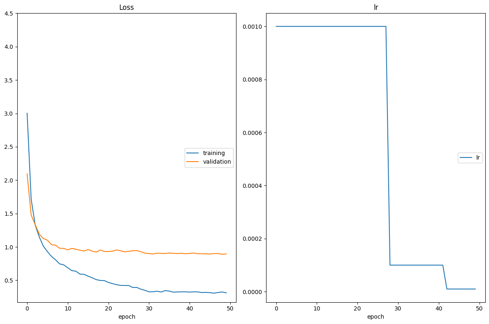

# Convolutional Neural Networks

## Project: Write an Algorithm for Landmark Classification


### Transfer learning

In the previous notebook we have trained our own CNN and we got a certain performance. Let's see how hard it is to match that performance with transfer learning.

---
## " style="width:50px"/> Step 0: Setting up

The following cells make sure that your environment is setup correctly and check that your GPU is available and ready to go. You have to execute them every time you restart your notebook.


```python
# Install requirements
!pip install -r requirements.txt | grep -v "already satisfied"
```


```python
from src.helpers import setup_env

# If running locally, this will download dataset (make sure you have at 
# least 2 Gb of space on your hard drive)
setup_env()
```

    GPU available
    Dataset already downloaded. If you need to re-download, please delete the directory landmark_images
    Reusing cached mean and std


    /home/brick-dev-server-1/Projects/AnhTH/DeeplearningCourse_Project3/src/helpers.py:98: FutureWarning: You are using `torch.load` with `weights_only=False` (the current default value), which uses the default pickle module implicitly. It is possible to construct malicious pickle data which will execute arbitrary code during unpickling (See https://github.com/pytorch/pytorch/blob/main/SECURITY.md#untrusted-models for more details). In a future release, the default value for `weights_only` will be flipped to `True`. This limits the functions that could be executed during unpickling. Arbitrary objects will no longer be allowed to be loaded via this mode unless they are explicitly allowlisted by the user via `torch.serialization.add_safe_globals`. We recommend you start setting `weights_only=True` for any use case where you don't have full control of the loaded file. Please open an issue on GitHub for any issues related to this experimental feature.
      d = torch.load(cache_file)


---
## " style="width:50px"/> Step 1: Create transfer learning architecture

Open the file `src/transfer.py` and complete the `get_model_transfer_learning` function. When you are done, execute this test:


```python
!pytest -vv src/transfer.py
```

    ============================= test session starts ==============================
    platform linux -- Python 3.10.15, pytest-8.3.4, pluggy-1.5.0 -- /home/brick-dev-server-1/miniconda3/envs/anhth/bin/python
    cachedir: .pytest_cache
    rootdir: /home/brick-dev-server-1/Projects/AnhTH/DeeplearningCourse_Project3
    collected 1 item                                                               
    
    src/transfer.py::test_get_model_transfer_learning PASSED                 [100%]
    
    =============================== warnings summary ===============================
    src/transfer.py::test_get_model_transfer_learning
      /home/brick-dev-server-1/Projects/AnhTH/DeeplearningCourse_Project3/src/helpers.py:98: FutureWarning: You are using `torch.load` with `weights_only=False` (the current default value), which uses the default pickle module implicitly. It is possible to construct malicious pickle data which will execute arbitrary code during unpickling (See https://github.com/pytorch/pytorch/blob/main/SECURITY.md#untrusted-models for more details). In a future release, the default value for `weights_only` will be flipped to `True`. This limits the functions that could be executed during unpickling. Arbitrary objects will no longer be allowed to be loaded via this mode unless they are explicitly allowlisted by the user via `torch.serialization.add_safe_globals`. We recommend you start setting `weights_only=True` for any use case where you don't have full control of the loaded file. Please open an issue on GitHub for any issues related to this experimental feature.
        d = torch.load(cache_file)
    
    src/transfer.py::test_get_model_transfer_learning
      /home/brick-dev-server-1/miniconda3/envs/anhth/lib/python3.10/site-packages/torchvision/models/_utils.py:208: UserWarning: The parameter 'pretrained' is deprecated since 0.13 and may be removed in the future, please use 'weights' instead.
        warnings.warn(
    
    src/transfer.py::test_get_model_transfer_learning
      /home/brick-dev-server-1/miniconda3/envs/anhth/lib/python3.10/site-packages/torchvision/models/_utils.py:223: UserWarning: Arguments other than a weight enum or `None` for 'weights' are deprecated since 0.13 and may be removed in the future. The current behavior is equivalent to passing `weights=ResNet18_Weights.IMAGENET1K_V1`. You can also use `weights=ResNet18_Weights.DEFAULT` to get the most up-to-date weights.
        warnings.warn(msg)
    
    -- Docs: https://docs.pytest.org/en/stable/how-to/capture-warnings.html
    ======================== 1 passed, 3 warnings in 7.31s =========================


---
## " style="width:50px"/> Step 2: Train, validation and test

Let's train our transfer learning model! Let's start defining the hyperparameters:


```python
batch_size = 128        # size of the minibatch for stochastic gradient descent (or Adam)
valid_size = 0.2       # fraction of the training data to reserve for validation
num_epochs = 50        # number of epochs for training
num_classes = 50       # number of classes. Do not change this
learning_rate = 0.001  # Learning rate for SGD (or Adam)
opt = 'adam'            # optimizer. 'sgd' or 'adam'
weight_decay = 1e-5    # regularization. Increase this to combat overfitting
save_weight_path = "checkpoints/model_transfer.pt"
export_weight_path = "checkpoints/transfer_exported.pt"
```


```python
from src.data import get_data_loaders
from src.optimization import get_optimizer, get_loss
from src.train import optimize
from src.transfer import get_model_transfer_learning

# Get a model using get_model_transfer_learning. Use one of the names reported here:
# https://pytorch.org/vision/0.10/models.html
# For example, if you want to load ResNet 18, use "resnet18"
# NOTE: use the hyperparameters defined in the previous cell, do NOT copy/paste the
# values
model_transfer = get_model_transfer_learning(model_name='resnet50', n_classes=num_classes)

# train the model
data_loaders = get_data_loaders(batch_size=batch_size)
optimizer = get_optimizer(
    model_transfer,
    learning_rate=learning_rate,
    optimizer=opt,
    weight_decay=weight_decay,
)
loss = get_loss()

optimize(
    data_loaders,
    model_transfer,
    optimizer,
    loss,
    n_epochs=num_epochs,
    save_path=save_weight_path,
    interactive_tracking=True
)
```


    

    


 __Question:__ Outline the steps you took to get to your final CNN architecture and your reasoning at each step.  Describe why you think the architecture is suitable for the current problem.

" style="width:25px"/>  __Answer:__ 

The model I trained from scratch achieved 69% accuracy. I experimented with ResNet18, which achieved an accuracy of around 75%, showing a 6% improvement. Consequently, I decided to use ResNet50 with a Bottleneck architecture, as it encourages the model to focus on selecting the most important features in each iteration while optimizing resource utilization. The results using the ResNet50 pretrained model showed an accuracy of 79%, a 10% improvement. Additionally, I used the Adam optimizer, which offers advantages such as automatically adjusting the learning rate for each parameter, handling gradients effectively, integrating momentum, and enabling faster optimization compared to SGD.

Now play with the hyperparameters and see which performance you can get on the validation set. You should get at least 60% for a passing grade, but a good model choice and a good training strategy could get you up to 80% or so. Let's see how close you can get!

---
## " style="width:50px"/> Step 3: Test the Model

Try out your model on the test dataset of landmark images. Use the code cell below to calculate and print the test loss and accuracy.  Ensure that your test accuracy is greater than 60% and matches more or less what you got on the validation set (otherwise you're overfitting!)


```python
import torch
from src.train import one_epoch_test
from src.transfer import get_model_transfer_learning

model_transfer = get_model_transfer_learning("resnet50", n_classes=num_classes)
# Load saved weights
model_transfer.load_state_dict(torch.load(save_weight_path))

one_epoch_test(data_loaders['test'], model_transfer, loss)
```

    /tmp/ipykernel_372447/1889886079.py:7: FutureWarning: You are using `torch.load` with `weights_only=False` (the current default value), which uses the default pickle module implicitly. It is possible to construct malicious pickle data which will execute arbitrary code during unpickling (See https://github.com/pytorch/pytorch/blob/main/SECURITY.md#untrusted-models for more details). In a future release, the default value for `weights_only` will be flipped to `True`. This limits the functions that could be executed during unpickling. Arbitrary objects will no longer be allowed to be loaded via this mode unless they are explicitly allowlisted by the user via `torch.serialization.add_safe_globals`. We recommend you start setting `weights_only=True` for any use case where you don't have full control of the loaded file. Please open an issue on GitHub for any issues related to this experimental feature.
      model_transfer.load_state_dict(torch.load(save_weight_path))
    Testing: 100%|██████████████████████████████████| 10/10 [00:02<00:00,  4.30it/s]

    Test Loss: 0.795979
    
    
    Test Accuracy: 79% (988/1250)


    


    0.7959787309169769


---
## " style="width:50px"/> Step 4: Export using torchscript

Now, just like we did with our original model, we export the best fit model using torchscript so that it can be used in our application:


```python
from src.predictor import Predictor
from src.helpers import compute_mean_and_std

# First let's get the class names from our data loaders
class_names = data_loaders["train"].dataset.classes

# Then let's move the model_transfer to the CPU
# (we don't need GPU for inference)
model_transfer = model_transfer.cpu()
# Let's make sure we use the right weights by loading the
# best weights we have found during training
# NOTE: remember to use map_location='cpu' so the weights
# are loaded on the CPU (and not the GPU)
model_transfer.load_state_dict(
    torch.load(save_weight_path, map_location="cpu")
)

# Let's wrap our model using the predictor class
mean, std = compute_mean_and_std()
predictor = Predictor(model_transfer, class_names, mean, std).cpu()

# Export using torch.jit.script
scripted_predictor = torch.jit.script(predictor)
scripted_predictor.save(export_weight_path)
```

    /tmp/ipykernel_372447/3670570678.py:15: FutureWarning: You are using `torch.load` with `weights_only=False` (the current default value), which uses the default pickle module implicitly. It is possible to construct malicious pickle data which will execute arbitrary code during unpickling (See https://github.com/pytorch/pytorch/blob/main/SECURITY.md#untrusted-models for more details). In a future release, the default value for `weights_only` will be flipped to `True`. This limits the functions that could be executed during unpickling. Arbitrary objects will no longer be allowed to be loaded via this mode unless they are explicitly allowlisted by the user via `torch.serialization.add_safe_globals`. We recommend you start setting `weights_only=True` for any use case where you don't have full control of the loaded file. Please open an issue on GitHub for any issues related to this experimental feature.
      torch.load(save_weight_path, map_location="cpu")


    Reusing cached mean and std


```python
import torch
from src.predictor import predictor_test
from src.helpers import plot_confusion_matrix

model_reloaded = torch.jit.load(export_weight_path)

pred, truth = predictor_test(data_loaders['test'], model_reloaded)

plot_confusion_matrix(pred, truth)
```

    100%|███████████████████████████████████████| 1250/1250 [00:52<00:00, 23.78it/s]


    Accuracy: 0.7888


    

    

